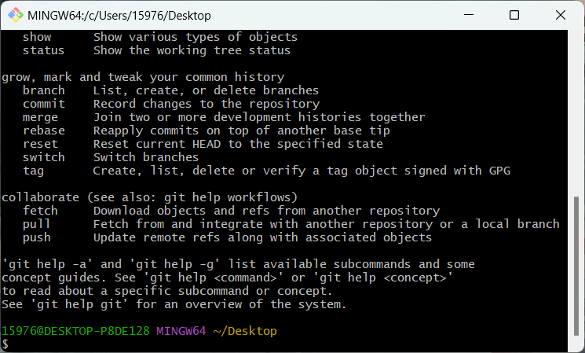

# 从头开始创建自己的博客
为了防止本人换电脑、电脑突然格式化、收藏的博客创建文章都失效了，写一篇博客记录自己创建个人静态博客的过程。
 <!-- more -->

## 1、拥有一个github账户
博主已经有了，所以不再赘述，以后会添加创建教程。
由于会需要用到github，而内网连接不稳定，所以建议在创建博客的过程中一直挂着梯子，保证与github的稳定连接，从而可以避免很多错误的出现。

## 2、安装Git
进入Git官网[Git官网](https://git-scm.com/)，点击**Downloads**下载：

选择自己的系统类型


我的是windows系统，选择64位系统（这里可能要挂个梯子，我是不挂梯子不会跳出下载界面）

点击确定，注意自己的下载位置


打开下载器，基本可以一直next，注意选择自己的下载地址。这里建议在自己的软件盘创建一个文件夹，将Git下载在这个文件夹里，以后相删除的时候比较方便。


下载完成后右键菜单中会出现两个图标分别是**Open Git GUI here**和**Open Git Bash here**

点击**Open Git Bash here**，进入git界面，输入git回车。显示如下，git安装成功


## 3、安装nodejs
### 3.1下载nodejs
进入nodejs官网[nodejs官网](https://nodejs.org/en),选择左边的稳定版下载


基本也是一直next即可，唯一需要注意的是设置的安装目录。
之后打开cmd查看是否安装成功
>node -v 查看nodejs版本
npm -v 查看npm版本


### 3.2配置环境变量
在nodejs根目录,创建node_global，node_cache文件夹

以管理员身份运行cmd，输入以下命令
>npm config set prefix "E:\nodejs\node_global"
npm config set cache "E:\nodejs\node_cache"

注意改成自己的下载路径，**一定要以管理员身份运行cmd**
具体方法为win+R输入cmd之后ctrl+shift+enter启动

找到电脑环境变量的位置
**win10&win11**：右键此电脑——属性——高级系统设置——高级——环境变量
**win11还可以**：设置——系统——系统信息——高级系统设置——高级——环境变量
新建系统变量创建**NODE_HOME**变量，值为nodejs的根目录的地址
例如"E:\nodejs"
在系统变量中选择Path变量修改和添加如下属性


之后全局配置淘宝镜像
**以管理员身份运行cmd**
输入如下代码
``npm config set registry https://registry.npm.taobao.org``
之后输入``npm config ls``查看配置

至此nodejs安装完成。

## 4、安装Hexo
使用cnpm安装nodejs，之前已经配置了淘宝镜像源，只需要在cmd中输入如下指令
``npm install -g cnpm(-g表示全局安装)``
即可安装cnpm

输入指令``cnpm install -g hexo-cli``即可安装hexo
在cmd中输入命令``hexo -v``, 可查看安装hexo的版本

Hexo安装完成！

## 5、配置github
### 5.1新建github仓库
在自己的github中新建一个仓科，命名为"你的github账号名.com.io"（必须是自己的用户命，否组无效）,如下所示

ps.仓库创建成功不会立即生效，需要过一段时间，大概10-30分钟，或者更久

### 5.2配置SSH免密登录
1. 首先打开电脑文件夹，找到``C:\Users\用户名\ .ssh``文件夹并删除(如果没有，则无需操作)

2. 在``C:\Users\用户名``文件夹下右键打开**Git Bash Here**输入命令: ``ssh-keygen -t rsa -C "你的github登录邮箱" ``生成.ssh秘钥，输入后敲三次回车,生成了一个新的 ``C:\Users\您的用户名\ .ssh``文件夹，打开这个文件夹，找到``.ssh\id_rsa.pub``文件，记事本打开并复制里面的内容。

3. 打开github主页,进入个人设置 -> SSH and GPG keys -> New SSH key，把复制的内容粘贴进去，title 随便填，保存即可，我们的公钥就添加成功了，设置好如下图:


4. 检测是否设置成功只需要打开Git Bush ，输入命令``ssh -T git@github.com``，若显示如下

则配置成功。

5. ssh配置完成后需要在Git Bash中配置如下内容
``git config --global user.name "Github username"``注意是 username, 而非昵称
``git config --global user.email "xxx@qq.com"``填写 github 注册邮箱

至此github仓库配置完成！

## 6、使用Hexo搭建Blog
### 6.1新建Blog文件夹并配置
1. 在电脑中新建一个文件夹，因为是创建个人博客，所以命名为Blog，读者也可随意命名。
由于未来更新博客或者优化博客界面要使用到这个文件夹，所以不建议在任意位置创建，可以创建在自己设置的资料盘，以方便以后取用。
注意文件夹的使用权限，确保user有写入与修改的权限
在输入指令之前注意查看，否则会导致指令安装失败。


2. 在文件夹目录下右键打开Git Bash，输入指令``hexo init``初始化。
可能会失败几次，可能是连接不稳定的原因，多试几次就可以。
hexo会下载一些东西到当前文件夹，文件夹目录如下所示


3. 命令``hexo g``会在 public 文件夹下生成相关的 .html 文件，这些文件将来需要提交到 Github 上

4. 命令``hexo s``可以开启本地预览服务，打开浏览器访问 http://localhost:4000 即可看到博客内容, 按ctrl+c关闭本地预览。

### 6.2将博客部署到GitHub
1. 安装 hexo-deployer-git 插件
在文件更目录打开Git Bush，输入指令``npm install hexo-deployer-git --save``,即可将插件下载到文件夹目录。
2. 编辑Blog文件夹目录下的_config.yml 文件，在文件末尾添加如下内容:

其中 repository 中的内容即为 github 个人主页链接地址


3. 在Blog文件夹目录下，打开Git Bash并输入指令``hexo d``将本地 blog 推送到 github 远程仓库，推送成功后，即可通过 https://自己的uesername.github.io/ 访问个人博客了！例如博主的即为(https://arkninght.github.io/)

## 7、博客界面的美化
hexo官方提供了很多主题，地址: [Themes | Hexo](https://hexo.io/themes/), 选择喜欢的主题并点击即可跳转至github,阅读使用说明优化自己的主题。

## 8、向github上传文件
```git
任务：向github上传文件
方法一：本地没有git仓库
git clone HTTPS                         将远程仓库克隆到本地空间

git add .        			添加文件夹文件到本地空间

git commit -m "记录在log中的内容"	将文件commit到本地空间

git push origin main			将本地空间存储的内容上传到远程仓库

方法二：本地有git仓库且已经commit多次
git init			        将本地空间初始化

git remote add origin HTTPS		关联远程仓库  origin为远程仓库名字

git pull origin main			同步远程仓库与本地仓库

git add .
git commit -m "提交备注"
git push origin main
```

## 9、常用的git命令
```git
git status  查看当前仓库状态
git log     查看仓库操作记录，英文输入法下，按q可以退出git log
git branch  查看仓库分支情况
git branch <branch name>        创建一个新的分支，分支名称为branch name
git checkout <branch name>      切换到目标分支，branch name为目标分支名称
git checkout -b <branch name>   创建并切换到一个新的分支
git merge <branch name>         合并分支到当前分支，注意两个合并的分支不能有冲突
git branch -d <branch name>& git branch -D <branch name> 删除指定名称的分支
git tag <tag>                   为当前分支添加tag
git tag                         查看当前分支的tag
git reset --hard <版本号> & git reset --soft <版本号> 回退到某个git版本，版本号通过git log查看
	--hard，抛弃当前工作区的修改
	--soft，回退到之前的版本，但保留当前工作区的修改，可以重新提交
git push origin <分支名> --force 在本地仓库回退之后，需要同步远端仓库。加--force为强制执行，忽略版本问题

设置git代理
git config --global --get http.proxy
git config --global --get https.proxy

取消git代理
git config --global --unset http.proxy
git config --global --unset https.proxy

git push origin main 中的origin为远程仓库
当通过git clone HTTPS 创建本地仓库时，会自动将HTTPS创建为origin
但可以通过git remote add <name> HTTPS 来自己命名本地仓库的名称
该命令的含义为“将所有东西从我的本地主机推送到名为origin的远程主机的main分支”
此命令的结构更一般的形式是 git push -u <remote> <branch>（如果远程还没有分支，则在远端创建它(这就是-u标志的作用)）


```