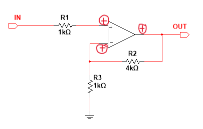
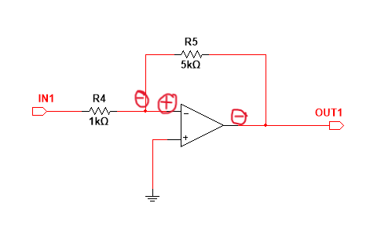

# 同相放大电路和反相放大电路

放大电路是在模电学习中非常重要的一个知识点。同相放大电路和反相放大电路也是在接触运算放大器电路中最简单、最基础也是非常重要的两个电路。

但是对于同相反相的定义、各自的电路特性以及优缺点本人还是缺少一些明显的认知，所以在此记录一些学习的知识。
 <!-- more -->

## 1、同相反相的概念
比较直观的解释就是就是输出波与输入波之间是否相差了180度的相位差。
更加直接的定义为：**输入端的极性和输出端是同一极性的就是同相放大器，而输入端的极性和输出端相反极性的则称为反相放大器。**

  

同相放大器

如上所示，在放大器正相输入断加入正向输入，输出端产生正向输出，输出端输出与输入端输入同相，构成**同相放大器**；同时在**负相端（非输入端）产生正向反馈**，构成负反馈。

  

反相放大器

如上所示，在放大器反相输入端加入正向输入，输出端产生反向输出，输出端输出与输入端输入反相，构成**反相放大器**；同时在**负相端（输入端）产生负向反馈**，构成负反馈。

## 2、同反相放大电路优缺点
### 同相放大电路

**优点**：输入阻抗和运放的输入阻抗相等，接近无穷大，即**输入阻抗极大**。

**缺点**：放大电路没有虚地，因此有**较大的共模电压**，抗干扰能力相对较差，使用时**要求运放有较高的*共模抑制比***；另一个小缺点就是放大倍数只能大于1。

### 反相放大电路
**优点**：两个输入端电位始终近似为零（同相端接地，反相端虚地），只有差模信号，**抗干扰能力强**。

**缺点**：**输入阻抗很小**，等于信号到输入端的串联电阻的阻值。

所以在选择时就需要按情况选择，例如
1. 在需要电路输入阻抗很大时选择同相放大器
2. 需要更宽的输入信号带宽时选择反相放大器，因为同相放大器受制于运放共模输入电压的范围
3. 在需要相同放大倍数的情况下，尽量选择小一些的电阻，可以减小输入偏置电流和分布电容的影响；而如果又要注重电路功耗，则需在大电阻之间折中。